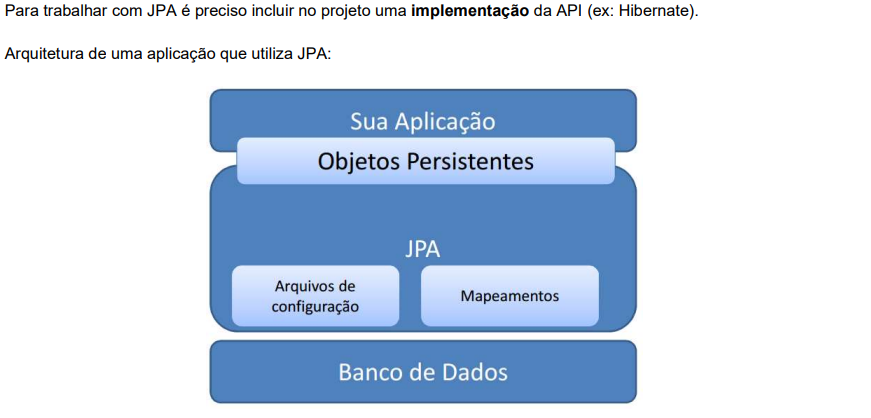

# Nivelamento: Mapeamento Objeto-Relacional com JPA / Hibernate

Este projeto é uma introdução prática ao mapeamento objeto-relacional (ORM) em Java utilizando JPA como interface e Hibernate como implementação. A atividade faz parte do curso de Java do professor Nelio Alves (educandoweb.com).

##  Objetivo do projeto

•Criar uma aplicação simples com uma classe Pessoa

•Mapear a entidade Pessoa com anotações JPA

•Persistir dados no banco MySQL utilizando Hibernate	
	
##  Conceitos principais

JPA (Java Persistence API) é uma especificação para persistência de dados em aplicações Java. Ela define como os dados devem ser mapeados entre objetos Java e tabelas de banco de dados.

Hibernate é uma das implementações mais populares da especificação JPA.

Utiliza-se o EntityManager para gerenciar as operações de inserção, consulta, atualização e remoção de dados em um contexto de persistência.

Importante: JPA é apenas uma interface, enquanto o Hibernate é a implementação concreta que faz o trabalho por trás dos panos.

   

##  Tecnologias utilizadas

•Java 17
	
•JPA (javax.persistence)

•Hibernate 5.4.12

•MySQL

•Maven

•STS (Spring Tool Suite) 

•XAMPP para gerenciamento do banco de dados

•Acesso ao banco de dados pelo PhpMyAdmin via: http://localhost/phpmyadmin/

